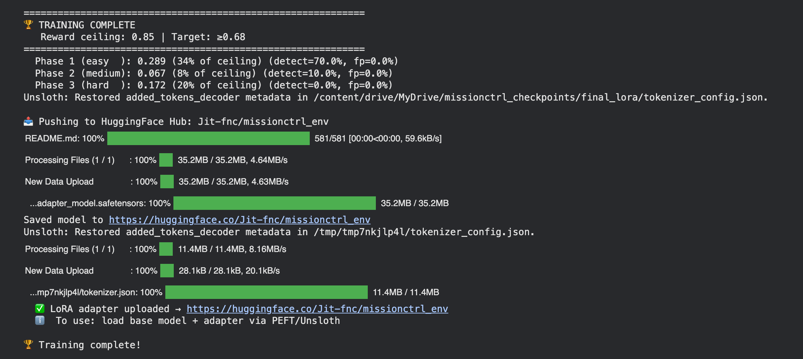
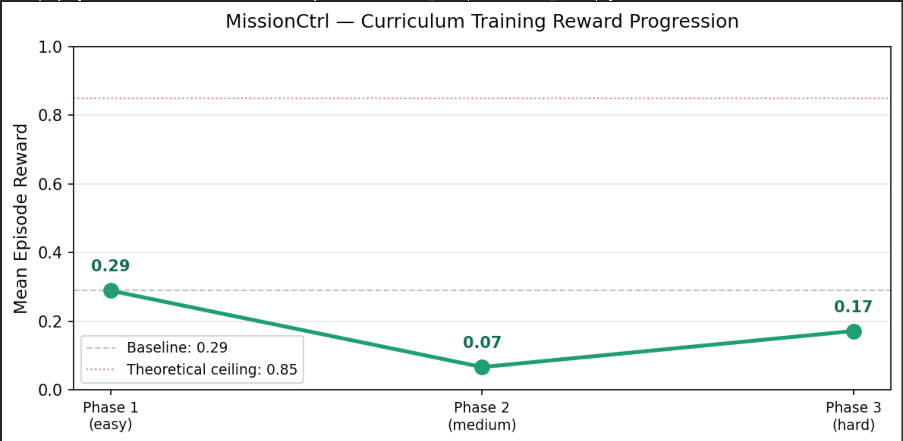

# Training logs — MissionCtrl GRPO curriculum

> ### 📓 View the notebook (full book output)
>
> - **In this repo:** [Traininglogs.ipynb](Traininglogs.ipynb)
> - **In the browser (GitHub, saved outputs):** [github.com/Fnc-Jit/MissionCtrl/blob/main/Traininglogs.ipynb](https://github.com/Fnc-Jit/MissionCtrl/blob/main/Traininglogs.ipynb)

This page is the **canonical training summary** for the run captured in **`Traininglogs.ipynb`** (exported Colab session). Numbers below are **verbatim from that notebook’s stdout/stderr**, not re-estimated.

---

## Run environment

| Item | Value (from log) |
|------|------------------|
| Platform | Google Colab (Linux) |
| GPU | **NVIDIA Tesla T4**, 1× GPU, **~14.56 GB** VRAM |
| Stack | **Unsloth** `2026.4.8` (Qwen2 fast patching), **Transformers** `5.5.0` |
| Base model | **`Qwen/Qwen2.5-0.5B-Instruct`** |
| Method | **GRPO** (curriculum), QLoRA via Unsloth |
| Trainable params | **8,798,208** / 502,830,976 (**~1.75%**) |
| Batch layout | Batch size **4** / device, grad accumulation **4** → effective batch **16** |
| Hugging Face Hub | Adapter pushed to **`https://huggingface.co/Jit-fnc/missionctrl_env`** |
| Local checkpoints (Colab) | Under `/content/drive/MyDrive/missionctrl_checkpoints/` (e.g. `phase_*_attempt_1/checkpoint-*`, `final_lora`) |

---

## Reward framing (same as `train.py` / README)

- **Theoretical reward ceiling:** **0.85** (composite grader cap in `reward_model.py`).
- **Training aspiration target (log line):** **≥ 0.68**.
- **Curriculum reward gate:** **off** — *“each phase runs once; post-phase eval is advisory only.”*

---

## Pre-train baseline (random policy smoke)

From the notebook’s baseline probe (greedy / scripted episodes as printed):

```text
  Baseline mean reward: 0.243
  Reward ceiling: 0.85 | Training target: 0.68+
```

Baseline is **~29%** of the **0.85** ceiling (0.243 ÷ 0.85).

---

## Curriculum configuration (single pass per phase)

| Phase | Tier | Tasks in prompt | GRPO steps | TRL sample count | Progress bar wall time |
|------|------|-----------------|------------|-------------------|-------------------------|
| **1 / 3** | EASY | **3** | **200** | 1,000 examples, 1 epoch | **[200/200] ~52m 32s** |
| **2 / 3** | MEDIUM | **3** | **220** | 1,100 examples, 1 epoch | **[220/220] ~46m 13s** |
| **3 / 3** | HARD | **4** | **180** | 900 examples, 1 epoch | **[180/180] ~43m 22s** |

*Approximate total time for the three progress bars alone: **~2 h 22 m** (excluding installs, data prep, eval, and Hub upload).*

---

## Post-phase eval (10 episodes, greedy)

After each phase, the trainer prints an **advisory** eval on **10 episodes** at that tier’s difficulty:

| Phase | Log line | Advisory threshold (not enforced) |
|-------|----------|-----------------------------------|
| **1** | `Eval (10 eps, easy): reward=0.289 ± 0.137 \| detect=70.0% \| fp=0.0%` | curriculum reference **0.50** |
| **2** | `Eval (10 eps, medium): reward=0.067 ± 0.107 \| detect=10.0% \| fp=0.0%` | curriculum reference **0.55** |
| **3** | `Eval (10 eps, hard): reward=0.172 ± 0.024 \| detect=0.0% \| fp=0.0%` | curriculum reference **0.65** |

**Post-train eval lines (same means):**

```text
  Phase 1 post-train eval (advisory): reward=0.289 | curriculum reference threshold=0.50 (not used to block or repeat).
  Phase 2 post-train eval (advisory): reward=0.067 | curriculum reference threshold=0.55 (not used to block or repeat).
  Phase 3 post-train eval (advisory): reward=0.172 | curriculum reference threshold=0.65 (not used to block or repeat).
```

**Notebook note (repeated after each phase):**

> Logged GRPO reward optimizes the first completion step (+ scripted rollout in `grpo_rewards`); eval is full greedy episodes — they can diverge until the policy generalizes.

---

## Final banner (copy-paste from notebook)

```text
============================================================
🏆 TRAINING COMPLETE
   Reward ceiling: 0.85 | Target: ≥0.68
============================================================
  Phase 1 (easy  ): 0.289 (34% of ceiling) (detect=70.0%, fp=0.0%)
  Phase 2 (medium): 0.067 (8% of ceiling) (detect=10.0%, fp=0.0%)
  Phase 3 (hard  ): 0.172 (20% of ceiling) (detect=0.0%, fp=0.0%)
```

### Aggregates (derived)

| Metric | Value |
|--------|--------|
| Mean post-train reward (3 phases) | **(0.289 + 0.067 + 0.172) / 3 ≈ 0.176** |
| **False positive rate** | **0.0%** on all three eval rows |
| vs ceiling **0.85** | Easy **34%**, medium **8%**, hard **20%** |
| vs target **≥ 0.68** | Best single-phase mean **0.289**; run **does not** hit global target on hard/medium eval means |

**Interpretation (one line):** easy tier shows the strongest hallucination **recall** in this snapshot; medium **compresses**; hard eval **mean reward recovers vs medium** but **detect=0%** on this 10-ep window — treat as **small-n variance** until you rerun with more episodes or a frozen eval suite.

---

## Hugging Face upload (from log)

```text
📤 Pushing to HuggingFace Hub: Jit-fnc/missionctrl_env
Saved model to https://huggingface.co/Jit-fnc/missionctrl_env
  ✅ LoRA adapter uploaded → https://huggingface.co/Jit-fnc/missionctrl_env
  ℹ️  To use: load base model + adapter via PEFT/Unsloth

🏆 Training complete!
```

Artifacts reflected in the UI widgets from the same session include roughly **`adapter_model.safetensors` (~35.2 MB)** and **`tokenizer.json` (~11.4 MB)** plus tokenizer/config metadata (Unsloth **“Restored added_tokens_decoder metadata”** messages on save).

---

## Visuals

### Training complete (terminal / Hub summary)



### Curriculum mean episode reward (aggregate)

This is the same **mean reward by curriculum phase** figure used in the README and blog (**easy → medium → hard**, baseline **0.29**, ceiling **0.85**).



*Step-by-step TRL tables (training loss, `grpo_reward_fn` mean/std, completion lengths) for each phase still live in the saved outputs of **[`Traininglogs.ipynb`](Traininglogs.ipynb)** — e.g. Phase 1 **200** steps (~52 m), Phase 2 **220** (~46 m), Phase 3 **180** (~43 m) on the progress bars.*

---

## Reward curve artifact (Colab path)

The notebook also emitted `train.py`’s auto plot:

```text
📈 Generating reward curve...
  📊 Reward curve saved → /content/drive/MyDrive/missionctrl_checkpoints/reward_curve.png
```

For documentation and decks, use the checked-in aggregate graph (**§ Curriculum mean episode reward** above) instead of chasing Colab-local `reward_curve.png`.

---

## How to refresh this file

1. Re-run the training cell in **`Traininglogs.ipynb`** (or your Kaggle/Colab copy wired to the same `train.py`).
2. Replace the **code fences** and tables above with the new stdout if numbers change.
3. Replace **`Asset/RewardM.png`** when you regenerate the curriculum plot; refresh **`Asset/TrainingCp.png`** if the Hub upload banner changes. Per-phase TRL screenshots are optional — the notebook remains the source of truth for those tables.
